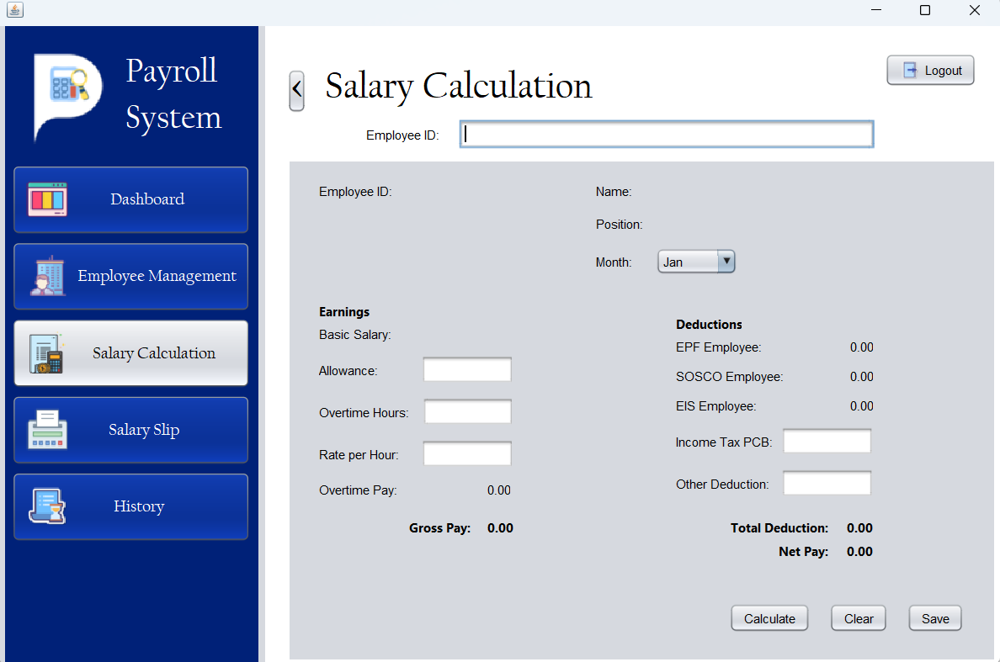

# CAT201-Project-HR-Payroll-System 🏢💼

<table>
  <tr>
    <td></td>
    <td></td>
  </tr>
</table>

### Team Member Group 17 🤖
1. Choo Sin Jie (164517) 
2. Cheah Jia Ning (164328)
3. Chiang Ho Lei (163715)
4. Wong Wei Ze (164825)

## Overview 📊

This system offers a range of features to manage employee data, calculate salaries, generate salary slips, and maintain an audit trail of system activities. It ensures data security and supports informed decision-making through detailed analytics and reporting.

## Features 🌟

### Dashboard 📈

- Provides visual representations of employee demographics and commission structures.
- Lists current workforce data.
- Accessible only to authorized personnel for secure data management.

### Employee Management 👥

- Allows adding, updating, and removing employee records.
- Facilitates dynamic adjustment to staffing needs and roles.

### Salary Calculation 💵

- Inputs allowances, overtime, deductions, etc., to calculate gross pay, total deductions, and net pay.
- Ensures accurate and consistent calculations with flexible data updates.

### Salary Slip Generator 🧾

- Generates detailed salary slips with comprehensive employee data and calculation details.
- Promotes transparency and precise financial practices.

### Audit Trail 🔍

- Records system activities, including types, timestamps, and action details.
- Ensures accountability, transparency, and compliance with data integrity and security standards.

## Getting Started 🚀

Ready to utilize the HR & Payroll System? Follow these steps to get started:

1. Use git clone command to duplicate the repository to your local machine.
2. Navigate to the cloned repository to set it as your current working directory.
3. Launch an Integrated Development Environment (IDE), preferably NetBeans, and open the project.
4. The project employs an SQLite database.
5. Navigate to src >> payroll >> system >> db.
6. Modify line 19 in db to update the connection path to reflect the local path on your machine for the database.
7. Log in method:

   👤username: admin1 
   
   🔐password: 123456

